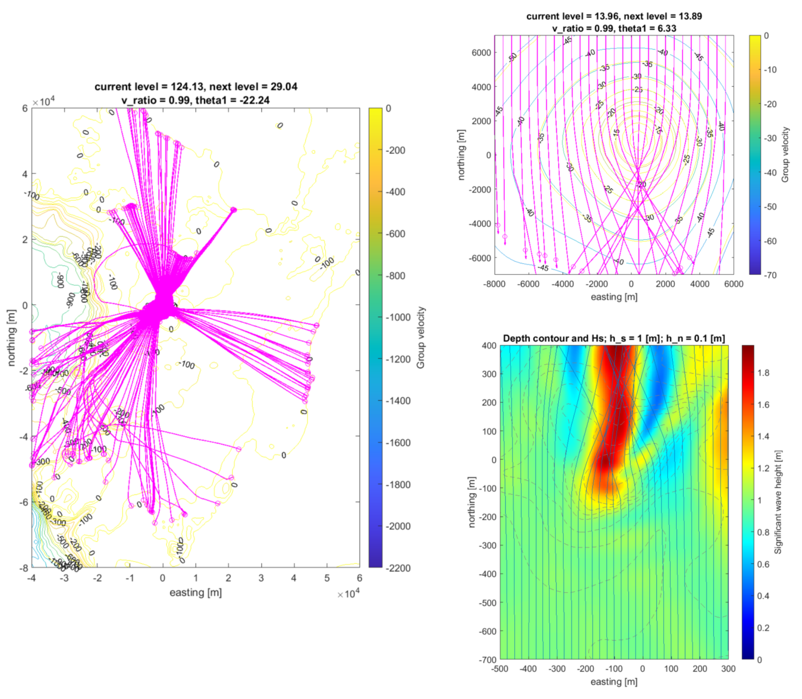

# Ray Tracing for Tsunami

We implement ray tracing based on Snell's law in Matlab. 
There are two methods that we have applied in the program
1. Snell's law that follows group speed (`TraceContour.m` and 
   `TraceContour_netCDF.m`)
2. Ray tracing equations (Arthur, 1946) (`TraceContour_Arthur.m`).

Wavenumbers ($`k`$) are computed using approximation formula which is much faster
than solving nonlinear equation of the dispersion relation using
Newton-Raphson or other nonlinear root finding iterative method. 
See (Guo, 2002).

Group speed is calculated from the formula in (Dingemans, 1994).

The second method has been tested for all ray tracing cases in (Arthur, 1946)

## To do 
- [ ] Implement netCDF bathy file `TraceContour_Arthur.m`
- [ ] Merge all `TraceContour*.m` files by using single object `RayTrace`
- [ ] Parallel version ray emanating from the sources.
- [ ] More robust ray tracing procedure in the first method.

## References
- (Arthur, 1946) - Refraction of water waves by islands and shoals with circular bottom-contours
- (Guo, 2002) - Simple and explicity solution of wave dispersion equation
- (Dingemans, 1994) - Water wave propagation over uneven bottoms

